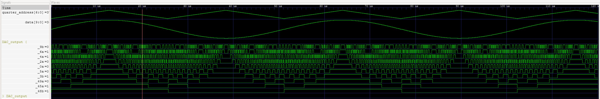

Owen Himsworth

ENGR 3410

Brad Minch

3/13/2025

# Miniproject 3  
**Digital Sine Waveform Generator using a 10-bit R-2R Ladder DAC**

---

## 1. Introduction

The objective of this project was to design and implement a digital circuit that produces a sinusoidal voltage waveform using a 10-bit R-2R ladder DAC. To minimize memory usage, only a quarter-cycle (0°–90°) of the sine wave is stored in a lookup table (128 samples). The full-cycle sine waveform (512 samples per cycle) is reconstructed by using the symmetry of the sine function. This design was implemented in SystemVerilog, simulated with Icarus Verilog, and verified using GTKWave. Finally, the waveform was captured from the iceBlinkPico board using an oscilloscope.

---

## 2. Design Overview

### 2.1 Circuit Architecture
- **Counter:**  
  A 9-bit counter cycles from 0 to 511, indexing the entire sine wave.

- **Quadrant Detection and Address Mapping:**  
  The most significant 2 bits of the counter determine the quadrant:
  - **Quadrants 0 and 1 (addresses 0–255):**  
    The lookup address is computed directly or in reverse (to capture the rising then falling portions of the positive half). The output data is generated by adding the quarter-cycle sample (from the lookup table) to a mid-scale offset (512).
  - **Quadrants 2 and 3 (addresses 256–511):**  
    The lookup address is computed similarly, but the quarter-cycle sample is subtracted from the mid-scale value (512) to form the negative half of the sine wave.

### 2.2 Memory Organization
- **Quarter-Cycle Memory:**  
  A dedicated memory module (implemented in `memory_quarter.sv`) stores 128 9-bit samples in an initialization file (`sine_quarter.txt`). This file contains the values for the first 90° of the sine function. This being generated by (`sine_gen.py`).
- **Data Formation:**  
  For the positive half of the cycle (Quadrants 0 and 1), the output data is given by:
```
data = 512 + quarter_data;
```
For the negative half (Quadrants 2 and 3), the output is:
```
data = 512 - quarter_data;
```
This centers the sine wave around 512 (the mid-scale value for a 10-bit DAC), ensuring a smooth transition between positive and negative values.

### 2.3 Physical Implementation
- **Pin Mapping:**  
A PCF file defines the FPGA pin assignments, mapping the 10 output signals (e.g., `_9b`, `_6a`, etc.) to the appropriate pins on the iceBlinkPico board.
- **DAC Interfacing:**  
The final 10-bit output is routed through these pins to drive the 10-bit R-2R ladder DAC, which converts the digital waveform into an analog signal.

---

## 3. Simulation and Test Bench

### 3.1 Simulation Setup
- **Test Bench:**  
A SystemVerilog test bench generates a clock and runs the simulation for a duration that covers at least one complete cycle (512 clock cycles). The simulation produces a VCD file (`tb_top.vcd`) for waveform analysis.
- **Waveform Viewing:**  
In GTKWave, the individual output bits are grouped into a single 10-bit bus so that the numeric (stepped analog) value can be viewed. The waveform shows the sinusoidal behavior as the bus value transitions smoothly between 0 and 1023.

### 3.2 Screenshot of Simulation Waveform

---

## 4. Measured Output

The design was implemented on the iceBlinkPico board. The analog output, captured with an oscilloscope, confirmed that the generated sine wave matches the simulation results in both amplitude and shape.  
*(Insert oscilloscope screenshot here showing the analog sine wave output)*

---

## 5. Conclusion

The project demonstrates generating a full-cycle sine wave using only a quarter-cycle lookup table. By using the symmetry of the sine function, the circuit is simple while still producing a high-resolution 10-bit output for the DAC. Simulation and hardware measurements confirmed that the circuit produces a smooth sinusoidal waveform with 512 discrete steps per cycle, meeting the project requirements.

---

## 6. Appendix – Source Files
- **sine.sv:** Top-level module implementing quarter-wave symmetry.
- **memory_quarter.sv:** Memory modules for the lookup table.
- **sine_tb.sv:** Test bench for simulation.
- **sine_quarter.txt:** Initialization file with 128 quarter-cycle sine samples.

---

## 7. Project Repo
https://github.com/Sailboy42/comparch-2025/tree/main/MP3